# Installation Flow Diagram

This document provides visual representations of the installation flow for setting up a complete development environment from scratch.

## Overview Flow

## Detailed Installation Phases

## Automation Coverage

## Software Categories Distribution

## Installation Time Breakdown

## Dependency Graph

## Platform Distribution

## Installation Method by Category

## Decision Tree: Installation Method

## Package Management Flow

## Validation Flow

```mermaid
graph TD
    START[Installation Complete] --> V1{Windows Validation}
    
    V1 --> V1A[Check PowerShell 7]
    V1 --> V1B[Check winget packages]
    V1 --> V1C[Check fonts]
    V1 --> V1D[Check drivers]
    
    V1A & V1B & V1C & V1D --> V2{WSL Validation}
    
    V2 --> V2A[Check Zsh]
    V2 --> V2B[Check kubectl]
    V2 --> V2C[Check terraform]
    V2 --> V2D[Check version managers]
    
    V2A & V2B & V2C & V2D --> V3{Config Validation}
    
    V3 --> V3A[Check Git config]
    V3 --> V3B[Check SSH keys]
    V3 --> V3C[Check 1Password]
    V3 --> V3D[Check chezmoi]
    
    V3A & V3B & V3C & V3D --> V4{App Validation}
    
    V4 --> V4A[Check JetBrains IDEs]
    V4 --> V4B[Check Docker]
    V4 --> V4C[Check Communication apps]
    
    V4A & V4B & V4C --> END[✅ Fully Validated]
    
    style START fill:#9ff,stroke:#333
    style END fill:#9f9,stroke:#333,stroke-width:3px
```

---

## Legend

- **✅ Automated**: Fully automated via chezmoi scripts
- **🔧 Semi-automated**: Requires minimal user interaction
- **📥 Manual**: Requires manual download and installation
- **❓ Investigation needed**: Package availability unclear
- **⚠️ Known issue**: Has documented installation problems

---

## Quick Reference

### Installation Command Paths

1. **Windows Features**: PowerShell (Admin) → `dism.exe`
2. **Prerequisites**: PowerShell → `winget install`
3. **Windows Bootstrap**: PowerShell → `chezmoi init --apply`
4. **WSL Setup**: PowerShell → `wsl --install`
5. **WSL Bootstrap**: Bash (WSL) → `chezmoi init --apply`
6. **Manual Steps**: Windows UI / Microsoft Store

### Time Estimates by Phase

| Phase | Active Time | Wait Time | Total |
|-------|-------------|-----------|-------|
| Phase 1-2 | 5 min | 10 min | 15 min |
| Phase 3 | 2 min | 30 min | 32 min |
| Phase 4-5 | 5 min | 90 min | 95 min |
| Phase 6 | 45 min | 5 min | 50 min |
| **Total** | **~1 hour** | **~2 hours** | **~3 hours** |

### Automation Percentage by Category

| Category | Automated | Manual | Total |
|----------|-----------|--------|-------|
| Development Tools | 90% | 10% | 100% |
| System Utilities | 95% | 5% | 100% |
| Office Utilities | 70% | 30% | 100% |
| Gaming Platforms | 80% | 20% | 100% |
| Hardware/Drivers | 20% | 80% | 100% |
| Communication | 60% | 40% | 100% |
| **Overall** | **70%** | **30%** | **100%** |

---

## Related Documents

- [INSTALLATION_CHECKLIST.md](INSTALLATION_CHECKLIST.md) - Comprehensive installation guide
- [QUICK_START_GUIDE.md](QUICK_START_GUIDE.md) - Fast-track installation
- [README.md](../README.md) - Repository overview
