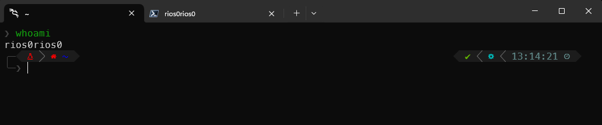
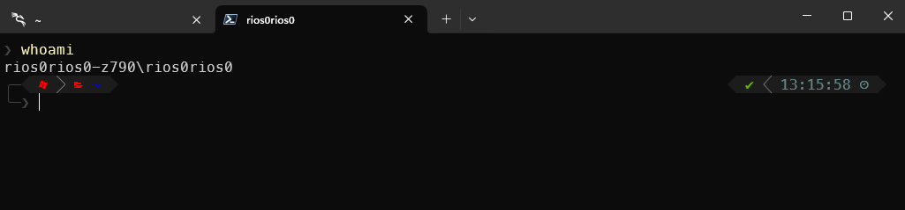
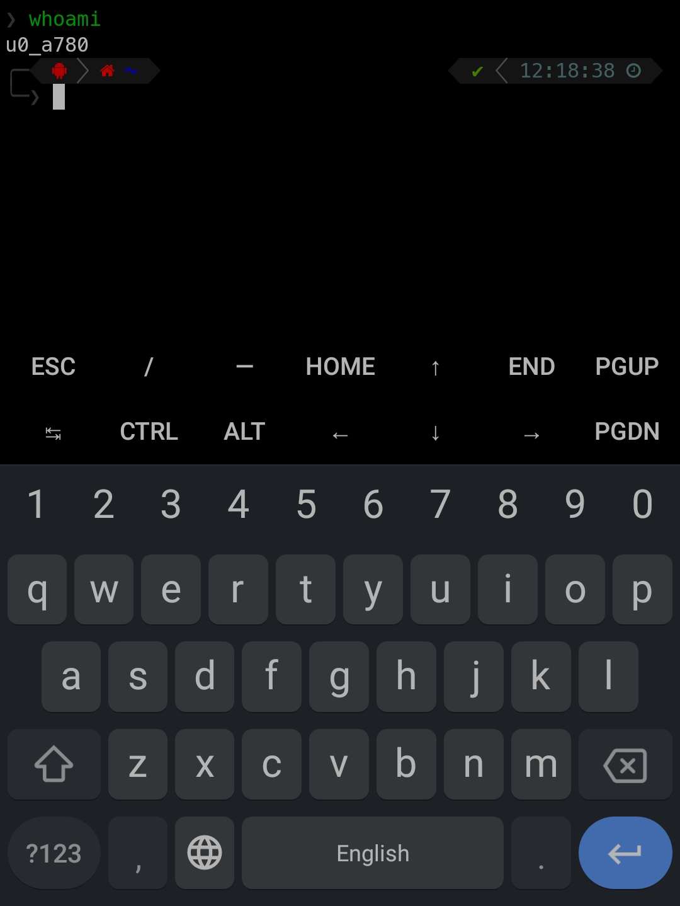

# dotfiles
My personal dotfiles repository, managed with [chezmoi](https://www.chezmoi.io/) and 1Password for sensitive information.

## Highlights

- **Cross-platform**: Configurations for Kali Linux in WSL, Windows 11 and Termux (Android).
- **Shells**: Zsh and PowerShell.
- **Terminal**: Windows Terminal.





## Installation

### Prerequisites

- **Linux (WSL or Android)**:
    - [git](https://git-scm.com/book/en/v2/Getting-Started-Installing-Git)
    - [age](https://github.com/FiloSottile/age)
    - [1Password CLI](https://developer.1password.com/docs/cli/get-started)

- **Windows 11**:
    - [PowerShell 7](https://learn.microsoft.com/en-us/powershell/scripting/install/installing-powershell-on-windows?view=powershell-7.4)
    - [git](https://git-scm.com/book/en/v2/Getting-Started-Installing-Git)
    - [age](https://github.com/FiloSottile/age)
    - [1Password CLI](https://developer.1password.com/docs/cli/get-started)

### Installation Steps

#### Kali Linux on WSL

1. Install prerequisites:
    ```sh
    sudo apt install git age
    ```

2. Install `chezmoi` and apply the `dotfiles`:
    ```sh
    sh -c "$(curl -fsLS get.chezmoi.io/lb)" -- init --apply rios0rios0
    ```

#### PowerShell 7 on Windows

1. Install PowerShell 7:
    ```powershell
    winget install Microsoft.PowerShell
    ```

2. Install some dependencies using `winget` in PowerShell:
    ```powershell
    winget install Git.Git
    winget install FiloSottile.age # add the age executable to the PATH manually
    winget install 1password-cli
    ```

3. Clone this repository and apply the dotfiles:
    ```powershell
    Set-ExecutionPolicy RemoteSigned -Scope Process
    chezmoi init --apply rios0rios0
    ```

#### Termux on Android

!! IMPORTANT: You should avoid using Termux from the Play Store, as it may not be up-to-date. Instead, use the official Termux app from [F-Droid](https://f-droid.org/en/packages/com.termux/).
Supporting article: https://www.reddit.com/r/termux/comments/zu8ets/do_not_install_termux_from_play_store/

1. Install prerequisites and `chezmoi`:
    ```sh
    apt install git chezmoi
    ```

2. Apply the `dotfiles`:
    ```sh
    chezmoi init --apply rios0rios0
    ```

## Configuration

### Encryption
- Sensitive files are encrypted using [age](https://github.com/FiloSottile/age).
- Unix-specific decryption script: `run_before_decrypt-private-key-unix.sh.tmpl`
- Windows-specific decryption script: `run_before_decrypt-private-key-windows.ps1.tmpl`

### Debugging Ideas
- Check the `chezmoi doctor` command to check the status of the installation.
- Run `git` commands with `GIT_TRACE=1` to see what's happening.

### Known Issues
1. Git stuck while doing any command with SSH.
   1. Zsh is using `ssh.exe` from Windows via alias/function. 
   2. Git is using `ssh.exe` from Windows via configuration file.
      * Due to "i" and "ii": `git` commands could be stuck when the `known_hosts` file is not created.
      * Workaround: run `ssh git@<YOUR_HOST>` to add the host to the `known_hosts` file via WSL using `ssh.exe` from Windows.
      * See TODO section for more information.

2. Notice that using `chezmoi age` you are not able to decrypt using SSH keys.
   That's why it's a prerequisite to install `age` to force `chezmoi` to use it for decryption.
   If you don't it, you could have errors like this:
   ```bash
   chezmoi: error at line 1: malformed secret key: separator
   ```

3. Notice that Windows has `path` size limitations (256 characters).
   If you are using WSL interoperability (calling `.exe` files inside WSL), you could have errors like this:
   ```bash
   /mnt/c/WINDOWS/system32/notepad.exe: Invalid argument
   ```
   That means, you exceeded the `path` size limitation on the current `path` you are running the command.

## References:
- https://github.com/patrick-5546/dotfiles
- https://github.com/budimanjojo/dotfiles
- https://www.chezmoi.io/user-guide/command-overview/
- https://www.chezmoi.io/reference/templates/variables/
- https://www.chezmoi.io/reference/special-files-and-directories/chezmoiscripts/
- https://masterminds.github.io/sprig/

## TODO:
- ~~check how to avoid 1Password duplicated calls~~ ✅ COMPLETED: Implemented centralized 1Password caching via `.chezmoitemplates/onepassword-cache.tmpl`
- check how to use variables from an included template
- when getting from scratch and changing bashes, it stuck on the new one
- when getting from scratch and having more than 1Password account, it gets the wrong account order
- the script `run_once_after_windows-001-create-ssh-known-hosts.ps1` is not working properly, because when calling
  `ssh.exe` via `git` commands in WSL, the command just freezes. So, the workaround is to do `ssh git@dev.azure.com` to each entry you want.
