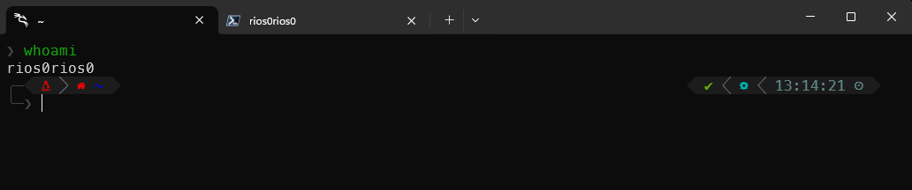
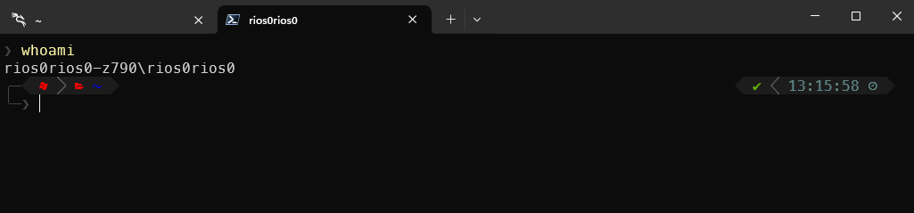
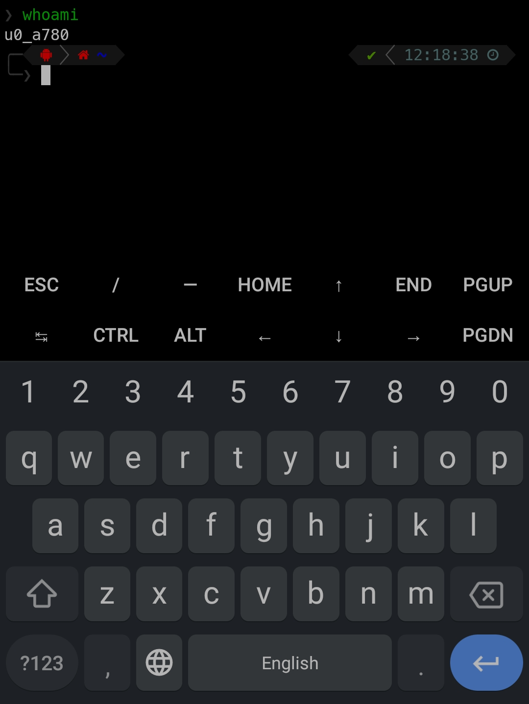

<h1 align="center">dotfiles</h1>
<p align="center">
    <a href="https://github.com/rios0rios0/dotfiles/releases/latest">
        </a>
    <a href="https://github.com/rios0rios0/dotfiles/blob/main/LICENSE">
        </a>
    <a href="https://sonarcloud.io/summary/overall?id=rios0rios0_dotfiles">
        </a>
    <a href="https://sonarcloud.io/summary/overall?id=rios0rios0_dotfiles">
        </a>
    <a href="https://www.bestpractices.dev/projects/12024">
        </a>
</p>

Personal dotfiles repository, managed with [chezmoi](https://www.chezmoi.io/) and 1Password for sensitive information.

## Features

- **Cross-platform**: Configurations for Kali Linux in WSL, Windows 11 and Termux (Android)
- **Shells**: Zsh and PowerShell
- **Terminal**: Windows Terminal





## Installation

### Prerequisites

- **Linux (WSL or Android)**:
    - [git](https://git-scm.com/book/en/v2/Getting-Started-Installing-Git)
    - [age](https://github.com/FiloSottile/age)
    - [1Password CLI](https://developer.1password.com/docs/cli/get-started)

- **Windows 11**:
    - [PowerShell 7](https://learn.microsoft.com/en-us/powershell/scripting/install/installing-powershell-on-windows?view=powershell-7.4)
    - [git](https://git-scm.com/book/en/v2/Getting-Started-Installing-Git)
    - [age](https://github.com/FiloSottile/age)
    - [1Password CLI](https://developer.1password.com/docs/cli/get-started)

### Kali Linux on WSL

1. Install prerequisites:

```sh
sudo apt install git age
```

2. Install `chezmoi` and apply the `dotfiles`:

```sh
sh -c "$(curl -fsLS get.chezmoi.io/lb)" -- init --apply rios0rios0
```

### PowerShell 7 on Windows

1. Install PowerShell 7:

```powershell
winget install Microsoft.PowerShell
```

2. Install some dependencies using `winget` in PowerShell:

```powershell
winget install Git.Git # if you have ASLR protection enabled, install Git from https://git-scm.com/download/win
winget install FiloSottile.age # add the age executable to the PATH manually
winget install 1password-cli
```

3. Clone this repository and apply the dotfiles:

```powershell
Set-ExecutionPolicy RemoteSigned -Scope Process
chezmoi init --apply rios0rios0
```

### Termux on Android

**IMPORTANT**: Avoid using Termux from the Play Store, as it may not be up-to-date. Instead, use the official Termux app from [F-Droid](https://f-droid.org/en/packages/com.termux/).
Supporting article: https://www.reddit.com/r/termux/comments/zu8ets/do_not_install_termux_from_play_store/

1. Install prerequisites and `chezmoi`:

```sh
apt install git chezmoi
```

2. Apply the `dotfiles`:

```sh
chezmoi init --apply rios0rios0
```

## Configuration

### Encryption

- Sensitive files are encrypted using [age](https://github.com/FiloSottile/age)
- Unix-specific decryption script: `run_before_decrypt-private-key-unix.sh.tmpl`
- Windows-specific decryption script: `run_before_decrypt-private-key-windows.ps1.tmpl`

### Debugging Ideas

- Check the `chezmoi doctor` command to check the status of the installation
- Run `git` commands with `GIT_TRACE=1` to see what's happening

### Known Issues

1. **Git stuck while doing any command with SSH.**
   - Zsh is using `ssh.exe` from Windows via alias/function
   - Git is using `ssh.exe` from Windows via configuration file
   - Due to the above: `git` commands could be stuck when the `known_hosts` file is not created
   - Workaround: run `ssh git@<YOUR_HOST>` to add the host to the `known_hosts` file via WSL using `ssh.exe` from Windows

2. **Notice that using `chezmoi age` you are not able to decrypt using SSH keys.**
   That's why it's a prerequisite to install `age` to force `chezmoi` to use it for decryption.
   Without it, you could have errors like:
   ```bash
   chezmoi: error at line 1: malformed secret key: separator
   ```

3. **Windows has `path` size limitations (256 characters).**
   If you are using WSL interoperability (calling `.exe` files inside WSL), you could have errors like:
   ```bash
   /mnt/c/WINDOWS/system32/notepad.exe: Invalid argument
   ```
   That means you exceeded the `path` size limitation on the current `path` you are running the command.

## References

- https://github.com/patrick-5546/dotfiles
- https://github.com/budimanjojo/dotfiles
- https://www.chezmoi.io/user-guide/command-overview/
- https://www.chezmoi.io/reference/templates/variables/
- https://www.chezmoi.io/reference/special-files-and-directories/chezmoiscripts/
- https://masterminds.github.io/sprig/

## Inspiration

- https://github.com/romkatv/dotfiles-public

## Contributing

Contributions are welcome! Please feel free to submit a Pull Request.

## License

See [LICENSE](LICENSE) for details.
